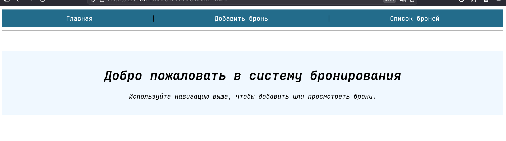
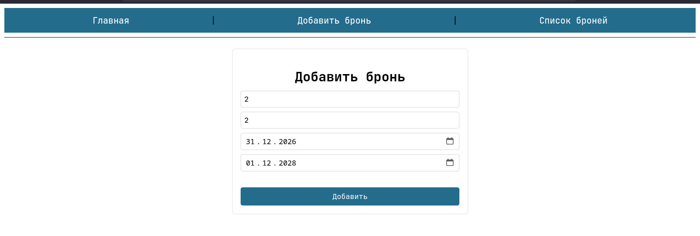
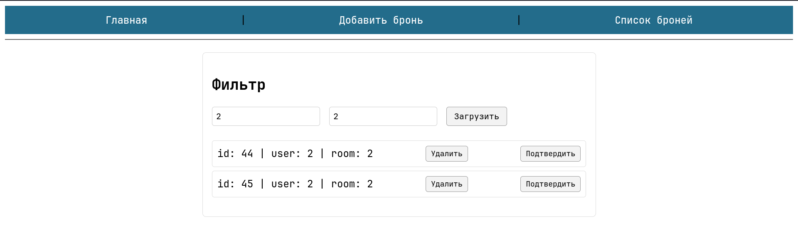

# Reservation System (Spring Boot + Vanilla JS)

Небольшое приложение для управления бронями: REST API на Spring Boot и простой фронтенд (HTML/CSS/JS).

## Что внутри
- Backend: Spring Boot 3, Spring Web, Spring Data JPA, Bean Validation
- БД: PostgreSQL
- Frontend: статическая страница (`frontend/index2.html`) + JS для вызова API
- CORS: разрешён origin `http://127.0.0.1:5500` (подходит для VS Code Live Server)

## Структура проекта
- `demo/` — Spring Boot приложение
- `frontend/` — простая страница для работы с API (добавление/список/подтверждение/отмена)


## Скриншоты

- Главная: 
- Добавление: 
- Список: 

### Предварительные требования

Проверьте настройки подключения к БД в `demo/src/main/resources/application.properties`:
```
spring.datasource.url=jdbc:postgresql://localhost:5432/postgres
spring.datasource.username=postgres
spring.datasource.password=root
spring.jpa.hibernate.ddl-auto=update
```
При необходимости поменяйте `username/password` и/или имя базы.

### Запуск backend
В отдельном терминале из каталога `demo/`:
```bash
mvn spring-boot:run
```
Приложение поднимется на `http://localhost:8080`.

### Запуск frontend
Откройте файл `frontend/index2.html` через статический сервер на адресе `http://127.0.0.1:5500` (так настроен CORS):
- Рекомендуемый вариант: VS Code «Live Server» (по умолчанию это как раз `127.0.0.1:5500`).
- Либо измените `allowedOrigins` в `demo/src/main/java/simpleapp/demo/reservation/config/CorsConfig.java` под ваш адрес/порт.

## API 

Запросы храняться в файле fetch.txt


